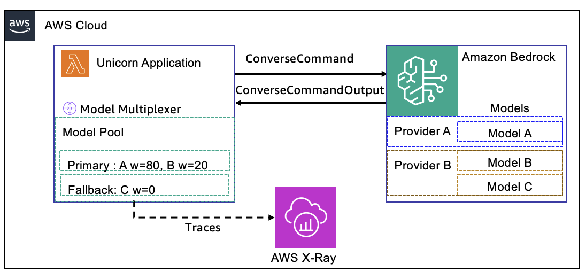

# Amazon Bedrock Model Multiplexer

A TypeScript client-side facade over the Amazon Bedrock SDK that distributes `ConverseCommand` requests across multiple models using weighted selection, automatic failover, per-model fault isolation, observability instrumentation, and opt-in refusal detection.

---

## Overview

The multiplexer adds resilience and automatic failover to Amazon Bedrock's Converse API. You configure a pool of models with weights and fallback designations; the multiplexer selects a model, isolates failures with per-model circuit breakers, and retries with a different model when one is throttled or unavailable. Your application sends a standard `ConverseCommandInput` and receives a standard `ConverseCommandOutput`. The failover is transparent.



---

## Quick Start

```typescript
import { ConverseCommandInput } from '@aws-sdk/client-bedrock-runtime';
import { createMultiplexer, ModelConfiguration } from 'bedrock-model-multiplexer';

const models: ModelConfiguration[] = [
  { modelId: 'amazon.nova-2-lite-v1:0', weight: 100, isFallback: false },
  { modelId: 'amazon.nova-pro-v1:0',    weight: 30,  isFallback: true  }
];

const multiplexer = createMultiplexer(models, { maxRetries: 3 });

const input: Omit<ConverseCommandInput, 'modelId'> = {
  messages: [{ role: 'user', content: [{ text: 'Explain quantum computing in simple terms' }] }],
  inferenceConfig: { maxTokens: 1000, temperature: 0.7 }
};

const response = await multiplexer.processRequest(input);

multiplexer.destroy();
```

---

## Configuration

```typescript
interface MultiplexerConfig {
  models: ModelConfiguration[];       // Models to register
  defaultTimeoutMs?: number;          // Per-request timeout in ms (default: 30000)
  maxRetries?: number;                // Max cross-model retry attempts
  clientConfig?: Record<string, any>; // Passed through to BedrockRuntimeClient
                                      // Set maxAttempts: 1 to disable SDK-level retries
  tracing?: {
    enabled: boolean;
    serviceName?: string;
    captureBodies?: boolean;
    captureModelSelection?: boolean;
  };
  refusalDetection?: {                // Opt-in: classify responses as refusals
    enabled: boolean;                 //   and retry with a different model
    modelPath: string;                // Path to the .onnx classifier model
    confidenceThreshold?: number;     // 0–1, default 0.5
    retryOnRefusal?: boolean;         // default true
  };
}
```
---

## Resilience

> **Tip:** Set `clientConfig: { maxAttempts: 1 }` to disable SDK-level retries so the multiplexer can fail over to a different model immediately on throttling.

| Scenario | What happens |
|---|---|
| **Throttling** (`ThrottlingException`) | The failing model is skipped and a different model is selected immediately — no delay, no same-model retry. |
| **Repeated failures** (5 within 60 s) | The model is temporarily removed from rotation for 30 s, then gradually re-introduced. |
| **Fail-fast errors** (`ValidationException`, etc.) | Request fails immediately; no failover. |
| **All models unavailable** | `processRequest()` throws `{ code: 'NO_MODELS_AVAILABLE' }`. Models recover automatically once the cool-down period expires. |
| **Refusal detected** *(opt-in)* | The model's response is classified as a refusal; the model is skipped and a different model is tried — identical to the throttling path. |

---

## Refusal Detection (Opt-In)

Some models may return polite refusals ("I can't help with that") instead of a useful answer. When refusal detection is enabled, the multiplexer classifies every successful response with an in-process ONNX binary classifier **before** returning it to the caller. If the response is classified as a refusal, the model is skipped and the request is automatically retried with a different model — the same failover path used for throttling.

The classifier uses [binary logistic regression](https://aws.amazon.com/what-is/logistic-regression/) to distinguish refusals from compliant responses. It runs in-process on the CPU via `onnxruntime-node` and typically completes in under 5 ms. The model file is **not** included in this repository — you must supply your own `.onnx` classifier and specify its path in the configuration.

### Enabling Refusal Detection

```typescript
import path from 'path';
import { createMultiplexer } from 'bedrock-model-multiplexer';

const multiplexer = createMultiplexer(models, {
  maxRetries: 3,
  refusalDetection: {
    enabled: true,
    modelPath: path.resolve(__dirname, '../models/refusal_classifier.onnx'),
    confidenceThreshold: 0.5,   // optional — default 0.5
    retryOnRefusal: true         // optional — default true
  }
});
```

### Configuration Reference

```typescript
interface RefusalDetectionConfig {
  /** Enable refusal detection on model responses */
  enabled: boolean;
  /** Absolute path to the .onnx model file */
  modelPath: string;
  /** Confidence threshold (0–1) above which a response is classified as a refusal.
   *  Raise for fewer false positives, lower for higher recall. Default: 0.5 */
  confidenceThreshold?: number;
  /** Whether to retry with a different model when a refusal is detected.
   *  Set to false to observe refusals via events without altering the response flow.
   *  Default: true */
  retryOnRefusal?: boolean;
}
```

### How It Works

```
Request ──▶ Select model ──▶ Invoke model ──▶ Classify response ──▶ Refusal?
                                                                      │
                                                         No ──▶ Return response
                                                         Yes ──▶ Skip model, retry
```

1. The ONNX session is loaded asynchronously at multiplexer construction time. If loading fails, the multiplexer continues without refusal detection (graceful degradation).
2. After each successful model invocation, the response text is extracted from `ConverseCommandOutput.output.message.content` and passed to the classifier.
3. The classifier returns a confidence score (0–1) for the "rejected" class. If the score meets or exceeds `confidenceThreshold`, the response is classified as a refusal.
4. When `retryOnRefusal` is `true`, a refusal triggers the same retry logic as a throttle: the current model is skipped and the multiplexer selects a different model. If all models refuse (or are exhausted), the request fails with `NO_MODELS_AVAILABLE`.
5. When `retryOnRefusal` is `false`, the response is returned as-is but refusal events are still emitted.

### Events

| Event | Signature | When |
|---|---|---|
| `refusal-detected` | `(modelId: string, confidence: number, responseText: string)` | A response is classified as a refusal (above threshold) |
| `refusal-classification` | `(modelId: string, isRefusal: boolean, confidence: number, latencyMs: number)` | Every classification completes (refusal or not) |

```typescript
multiplexer.on('refusal-detected', (modelId, confidence, text) => {
  console.log(`Refusal from ${modelId} (${(confidence * 100).toFixed(1)}%): ${text.slice(0, 80)}`);
});

multiplexer.on('refusal-classification', (modelId, isRefusal, confidence, latencyMs) => {
  console.log(`Classification: ${modelId} → ${isRefusal ? 'REFUSAL' : 'COMPLIED'} (${latencyMs}ms)`);
});
```

### Statistics

Refusal counts are tracked in both aggregate and per-model statistics:

```typescript
const stats = multiplexer.getStats();
stats.refusalCount;                         // total refusals across all models
stats.modelStats['amazon.nova-pro-v1:0'].refusalCount;  // refusals for a specific model
```

### Cleanup

Call `destroy()` to release the ONNX inference session along with all other multiplexer resources:

```typescript
multiplexer.destroy();
```

### Security Note

The ONNX model file (`refusal_classifier.onnx`) is loaded from the filesystem and runs inference entirely within the application process. No data leaves the process. Treat the model file like application code — verify that it comes from a trusted source and is not writable by untrusted users.

---

## Health & Statistics

```typescript
// Real-time health (suitable for load balancer probes)
const { status, code } = multiplexer.getSimpleHealthCheck();
// { status: 'healthy', code: 200 } or { status: 'unhealthy', code: 503 }

// Detailed per-model health
const health = multiplexer.getHealthStatus();
// health.isHealthy, health.models[modelId].circuitState, .errorRate, .avgResponseTimeMs

// Cumulative statistics
const stats = multiplexer.getStats();
// stats.successCount, .rateLimitCount, .refusalCount, .latencyMetrics.p95
```

---

## Security Considerations

Under the [AWS shared responsibility model](https://aws.amazon.com/compliance/shared-responsibility-model/), AWS is responsible for security of the cloud infrastructure that runs Amazon Bedrock. Customers are responsible for security in the cloud, including credential management, input validation, and content filtering. See [SECURITY.md](./SECURITY.md) for the full security policy.

- AWS credentials are managed entirely by the consuming application (IAM roles, environment variables, credential profiles). The library is designed to avoid reading files from disk or accessing `process.env`.
- All communication with Amazon Bedrock uses HTTPS/TLS 1.2+ as enforced by the AWS SDK v3.
- Enable [AWS CloudTrail](https://docs.aws.amazon.com/bedrock/latest/userguide/logging-using-cloudtrail.html) for auditing Amazon Bedrock API calls. Enable [model invocation logging](https://docs.aws.amazon.com/bedrock/latest/userguide/model-invocation-logging.html) for tracking data access patterns.
- Model IDs and request payloads should be validated before submission.
- For production workloads, configure [Amazon Bedrock Guardrails](https://docs.aws.amazon.com/bedrock/latest/userguide/guardrails.html). The library forwards requests without inspection.

### Required IAM Permissions

```json
{
  "Version": "2012-10-17",
  "Statement": [
    {
      "Effect": "Allow",
      "Action": [
        "bedrock:InvokeModel",
        "bedrock:InvokeModelWithResponseStream"
      ],
      "Resource": [
        "arn:aws:bedrock:us-east-1::foundation-model/amazon.nova-lite-v1:0",
        "arn:aws:bedrock:us-east-1::foundation-model/amazon.nova-pro-v1:0"
      ]
    }
  ]
}
```

Replace the `Resource` ARNs with the specific models used by the application. Avoid `Resource: "*"`. Do not pass hardcoded credentials via `clientConfig`.

---

## Testing

```bash
npm test
npm run test:coverage
```

---

## Related Resources

| Resource | Link |
|---|---|
| Amazon Bedrock Documentation | https://docs.aws.amazon.com/bedrock/ |
| Service Quotas | https://docs.aws.amazon.com/bedrock/latest/userguide/quotas.html |
| Token-Based Throughput Quotas | https://docs.aws.amazon.com/bedrock/latest/userguide/quotas-token-burndown.html |
| AWS SDK for JavaScript v3 | https://github.com/aws/aws-sdk-js-v3 |
| Behavioral Specification | [multiplexer-spec/multiplexer-spec.pdf](./multiplexer-spec/multiplexer-spec.pdf) |
| Security Policy | [SECURITY.md](./SECURITY.md) |
| Examples | [src/examples/](./src/examples/) |

Contributing
------------

- See [CONTRIBUTING.md](./CONTRIBUTING.md) for the full contribution policy.

License
-------

This project is licensed under the MIT License - see the [LICENSE](LICENSE) file for details.