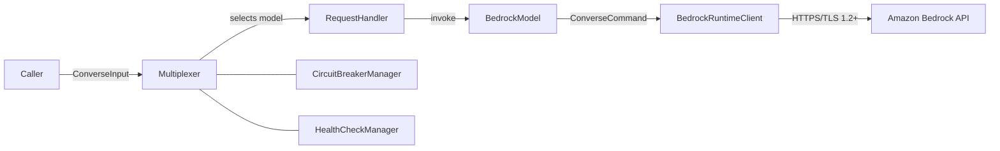

# Security

## Architecture Overview

The following diagram shows the data flow and trust boundaries for the Amazon Bedrock Model Multiplexer:



All communication with Amazon Bedrock uses HTTPS/TLS 1.2+ via the AWS SDK v3. No data is stored by this library — it is a stateless routing layer that forwards requests and returns responses.

## Threat Model

| Threat | Description | Mitigation |
|--------|-------------|------------|
| **Credential exposure** | Credentials passed via `clientConfig` could be logged by application code | This library does not log `clientConfig` or any credential material. Use IAM roles (instance profiles, Lambda execution roles, ECS task roles). Do not hardcode credentials. |
| **Prompt injection passthrough** | The library forwards prompts to Amazon Bedrock without inspection | This library is intentionally transparent. Consumers must sanitize inputs before calling `processRequest()`. Use Amazon Bedrock Guardrails for content filtering in production. |
| **Circuit breaker DoS** | Repeated failures could open all circuit breakers, causing errors for all requests | `maxRetries` and `failureThreshold` config limits blast radius. Circuit breakers recover automatically via the half-open probe mechanism. |
| **Information disclosure via errors** | SDK errors may contain request metadata (request IDs, model ARNs) | SDK errors pass through unchanged to the caller. Consumers must not surface raw SDK errors to end users — wrap them in application-level error responses. |

## AWS Service Security Guidelines

### Amazon Bedrock

The library invokes `bedrock:InvokeModel` on every `processRequest()` call, and `bedrock:InvokeModelWithResponseStream` when using `invokeStream()`. Scope permissions to the specific model ARNs your application uses:

```json
{
  "Version": "2012-10-17",
  "Statement": [
    {
      "Effect": "Allow",
      "Action": [
        "bedrock:InvokeModel",
        "bedrock:InvokeModelWithResponseStream"
      ],
      "Resource": [
        "arn:aws:bedrock:us-east-1::foundation-model/amazon.nova-lite-v1:0",
        "arn:aws:bedrock:us-east-1::foundation-model/amazon.nova-pro-v1:0"
      ]
    }
  ]
}
```

Replace the `Resource` ARNs with the specific models your application uses. Avoid `Resource: "*"`.

All Amazon Bedrock API calls use HTTPS/TLS 1.2+ via AWS SDK v3 defaults. No plaintext communication occurs.

### AWS X-Ray (optional)

X-Ray tracing is opt-in via the `tracing.enabled` configuration option. When enabled, the execution role requires:

```json
{
  "Version": "2012-10-17",
  "Statement": [
    {
      "Effect": "Allow",
      "Action": [
        "xray:PutTraceSegments",
        "xray:PutTelemetryRecords"
      ],
      "Resource": "*"
    }
  ]
}
```

> **Note**: `Resource: "*"` is required for X-Ray — trace segment ARNs are generated dynamically at runtime and cannot be predicted in advance. This matches the AWS-managed `AWSXRayDaemonWriteAccess` policy.

### AWS Security Token Service (AWS STS)

AWS STS is a transitive dependency of the AWS SDK credential provider chain. This library makes no direct STS API calls. Credential resolution is handled entirely by the SDK.

## Shared Responsibility

AWS secures the Amazon Bedrock service infrastructure, physical facilities, and network. **Customer responsibilities include:**

- IAM credential management (use roles, not hardcoded keys)
- Input sanitization before calling `processRequest()`
- Output filtering before returning responses to end users
- Enabling Amazon Bedrock Guardrails for production workloads
- Monitoring circuit breaker state and error rates

## AI Security

This library is a routing layer. It forwards requests to Amazon Bedrock without inspecting or modifying content. **Implement AI security controls at the application layer.**

### Required controls for production workloads

1. **Input validation** — Sanitize and validate user-supplied prompts before calling `processRequest()`. Reject inputs that exceed expected length or contain injection patterns.

2. **Amazon Bedrock Guardrails** — Configure Guardrails for content filtering, PII detection, and denied topics. Pass `guardrailIdentifier` and `guardrailVersion` in your `ConverseCommandInput`. See [Amazon Bedrock Guardrails documentation](https://docs.aws.amazon.com/bedrock/latest/userguide/guardrails.html).

3. **Output filtering** — Inspect model responses before returning them to end users. Handle `GUARDRAIL_INTERVENED` stop reasons.

### Bias and fairness

When using weighted model selection, different models may exhibit different performance characteristics across user populations. Evaluate each model for bias before assigning production weights. Monitor aggregated outputs for fairness.

### Model approval

All models referenced in the examples are placeholders. Replace them with the specific Amazon Bedrock model IDs your organization has approved. Verify that your organization's AI governance policy permits use of each model before deploying to production.

## Reporting Security Issues

Do not open a public GitHub issue for security vulnerabilities. Follow the [AWS Vulnerability Reporting](https://aws.amazon.com/security/vulnerability-reporting/) process.

## Security Scanning

| Tool | Last Scan | Critical | High | Medium | Low |
|------|-----------|----------|------|--------|-----|
| `npm audit` | 2026-03-11 | 0 | 0 | 0 | 1 |

| ID | Severity | Description | Status |
|----|----------|-------------|--------|
| GHSA-73rr-hh4g-fpgx | Low | `diff` (jsdiff) DoS in parsePatch/applyPatch | Dev dependency only — not reachable in production. |

Run `npm audit` to verify current status. Address all Critical and High findings before production deployment.

## Data Security

This library is a stateless routing facade. It does not read, store, inspect, or transform request or response content. Its only mutation is stamping `modelId` onto the caller's `ConverseCommandInput` based on its routing decision.

- **Encryption in transit**: All communication with Amazon Bedrock uses HTTPS/TLS 1.2+ as enforced by the AWS SDK v3.
- **Encryption at rest**: This library does not persist data. Encryption at rest is the responsibility of the consuming application.
- **Key management**: This library does not manage encryption keys. Use IAM roles for credential management. For Amazon Bedrock features that support customer-managed keys, configure AWS KMS per [Amazon Bedrock encryption documentation](https://docs.aws.amazon.com/bedrock/latest/userguide/data-encryption.html).
- **Access logging**: Enable AWS CloudTrail for `bedrock:InvokeModel` API call logging. This library emits operational events (model ID, latency, outcome) that can be used for audit purposes — these events do not contain request or response content.
